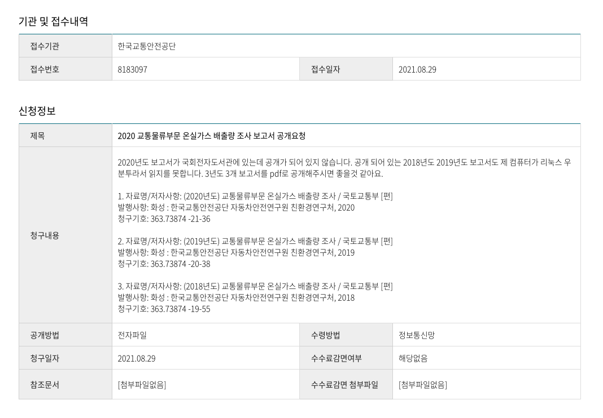

# R shiny website

http://co2.codefor.kr

## Hackathon page

https://dacon.io/competitions/official/235758/codeshare/3219

## R report

[R report 교통탄소중립.ipynb](./교통탄소중립.ipynb)

## 교통물류 온실가스 배출량 조사 18-20년

- [2018년도 교통물류 온실가스 배출량 조사 최종보고서.pdf](./교통물류부문_온실가스_배출량_조사/2018년도_교통물류_온실가스_배출량_조사_최종보고서.pdf)
- [2019년도 교통물류 온실가스 배출량 조사 최종보고서.pdf](./교통물류부문_온실가스_배출량_조사/2019년도_교통물류_온실가스_배출량_조사_최종보고서.pdf)
- [2020년도 교통물류 온실가스 배출량 조사 최종보고서.pdf](./교통물류부문_온실가스_배출량_조사/2020년도_교통물류_온실가스_배출량_조사_최종보고서.pdf)

### 정보공개 청구내역
  
